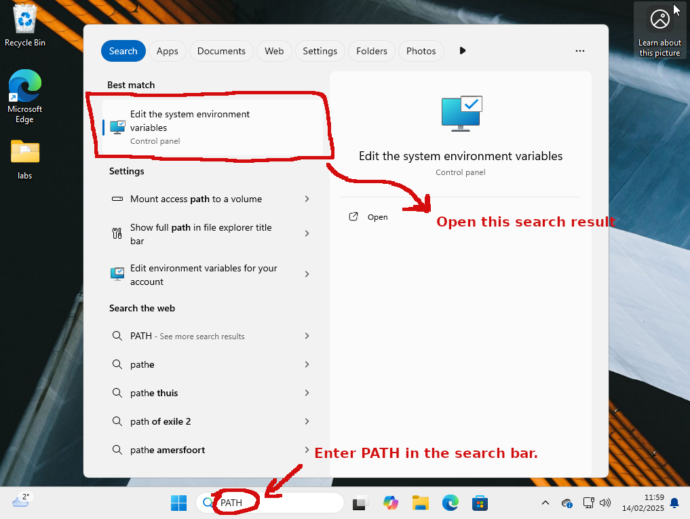
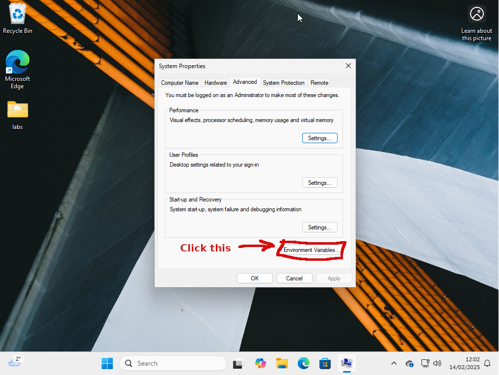
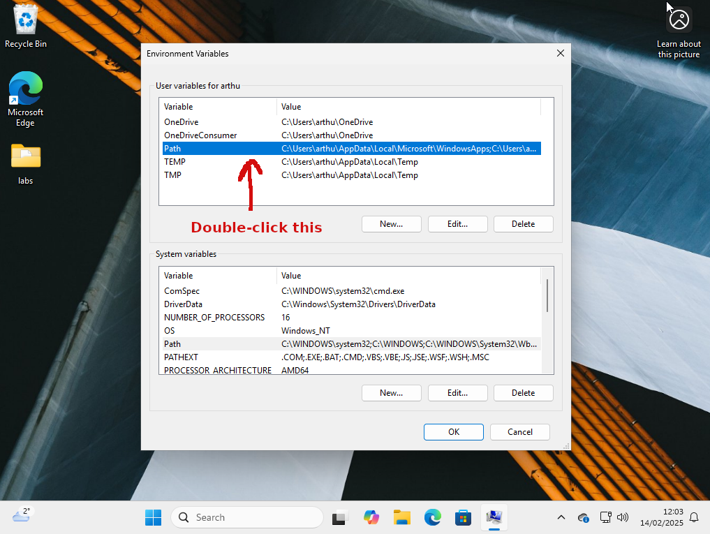
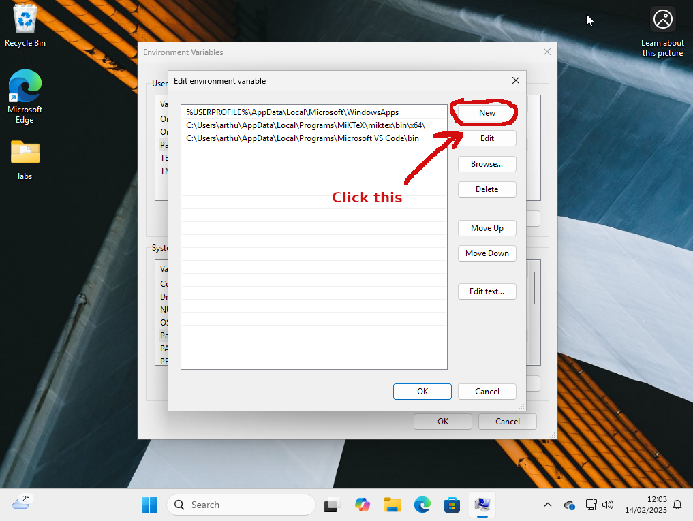
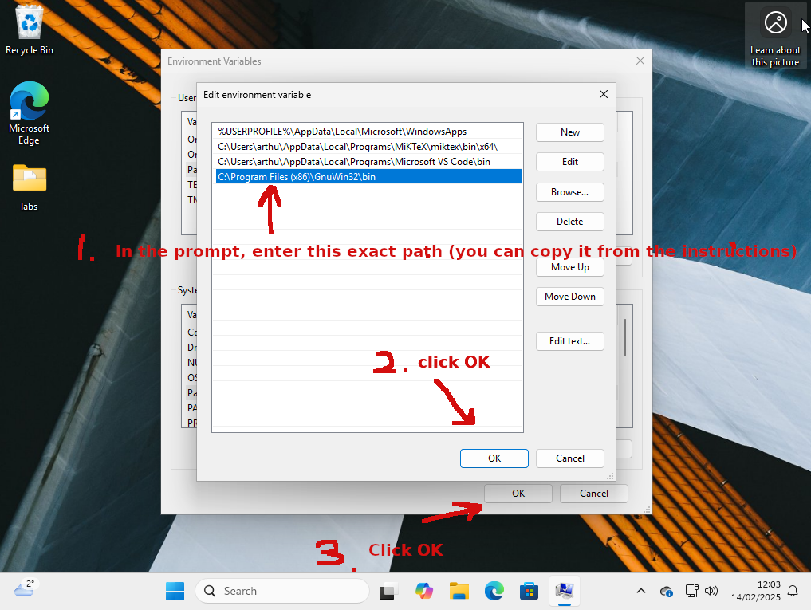
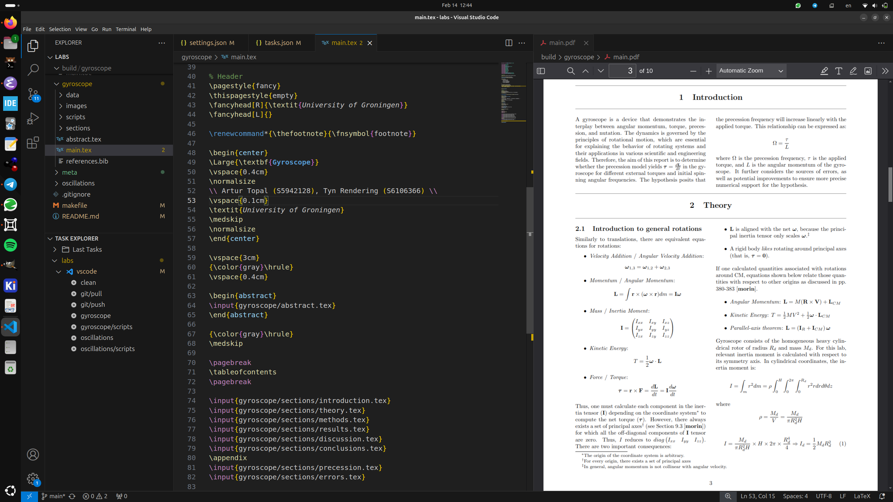
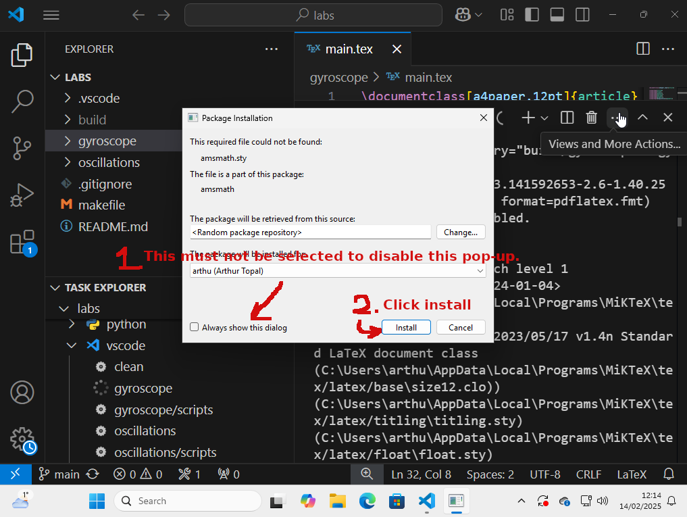
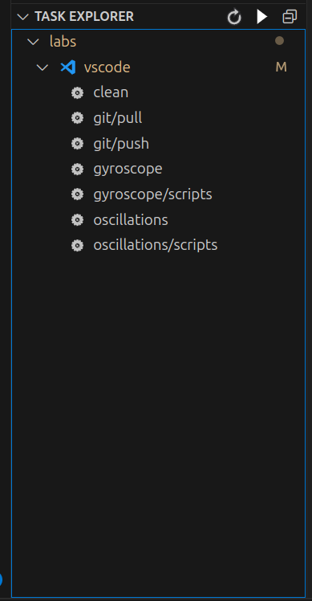

# Contents

- [TODO](#todo)
- [Introduction](#introduction)
- [Guide (for Visual Studio Code)](#guide-for-visual-studio-code)
  - [Prerequisites](#prerequisites)
  - [MikTex on Windows](#miktex-on-windows)
  - [Github](#github)
- [Usage](#usage)
  - [Project Structure](#project-structure)
- [Actions](#actions-under-task-explorer)
- [Short Manual](#short-manual)
- [References](#references)

# TODO

- [ ] Implement *create* action for automating the creation of a new lab.
- [ ] Support real-time collaborative editing between Emacs and Visual Studio Code.
- [ ] Support other scripting languages (like Lua or Julia)
- [ ] Support flexible Python actions (for running multiple .py files like needed for *oscillations*)  

# Introduction

This repository contains all the Physics labs that I and my lab partners performed in the University of Groningen. The labs are:
* Mechanics and Relativity
    * oscillations
    * gyroscope
* Electricity and Magnetism
    * capacitors

# Guide (for Visual Studio Code)

**Note:** I am using Linux/Emacs so you might need to tweak your system somewhat for it to work properly on Windows/MacOS.

## Prerequisites
1. Install [Visual Studio Code](https://code.visualstudio.com/).
2. Install [MikTex](https://miktex.org/download). (LaTeX compiler) (see below for further configuration)
3. Install [GNU Makefile](https://sourceforge.net/projects/gnuwin32/files/make/3.81/make-3.81.exe/download?use_mirror=altushost-swe&download=) (build system)
4. Install [Git](https://git-scm.com/downloads/win). (select *64-bit Git for Windows Setup*)
5. Follow [this manual](https://docs.github.com/en/authentication/connecting-to-github-with-ssh/generating-a-new-ssh-key-and-adding-it-to-the-ssh-agent?platform=windows) to setup git ssh.

Stup 3 require one more configuration on Windows - adding the *make* program to PATH. To do this, follow the steps under [MikTex](#miktex-setup) 

Step 5 is tedious but crucial. This is like auth for git remote repositories. You will use the combination of your github name and passphrase to push your changes to Github. If you use the Task (aka the button) in Visual Studio Code, you would also need to enter the passphrase in the prompt.

## Setup the project

### MikTex on Windows

1. Type *PATH* in the search bar. Then, open *Edit the system environment variables*


2. In the appeared window, click *Environment Variables...*


3. Then, double-click the *Path* like shown in the image below


4. In the new window, click *New*


5. In the prompt, enter this **exact** path: *C:\\Program Files (x86)\\GnuWin32\\bin* and click *OK* twice like shown in the image below


6. Done.

### Github 



1. Download the archive with the project [here](https://github.com/euwaka/labs).
2. Unzip it.
3. Open it in Visual Studio Code. You can configure Visual Studio Code to your liking (an example is shown on the image above).
4. If extensions were not installed automatically, manually install:
    * [LaTeX](https://marketplace.visualstudio.com/items?itemName=mathematic.vscode-latex)
    * [PDF Viewer](https://marketplace.visualstudio.com/items?itemName=mathematic.vscode-pdf)
    * [Task Explorer](https://marketplace.visualstudio.com/items?itemName=spmeesseman.vscode-taskexplorer)
5. You are ready to go.

**Note**: on the first LaTeX compilation, *MikTex* will prompt you to install many LaTeX packages that are used in LaTeX source files. This is done only once, and there is a tick (see the image below) on the prompt which allows the installation of all the required packages at once.


# Usage

1. Open a file that you work on (Python script, LaTeX source, etc.).
2. Make changes.
3. Click one of the actions under *Task Explorer* in the Explorer Menu. (see later for more information on actions)

## Project Structure

1. **labs**: the root directory contains separate directories for different labs (e.g., oscillations, gyroscope, etc.). Every file (.py, .jpeg, .tex, .csv, etc.) associated with a specific project is located under the directory with the name of the project.
2. **meta files**:
    * *makefile*: this is a build system that we use for Emacs/Visual Studio Code
    * *.vscode*: those are configuraitons for Visual Studio Code.
    * *.gitignore*: here are listed files/directories that will not be uploaded to Github (like .pdf)
	* *meta/*: images for the README.md file are here
3. **Project files (the same in every lab directory)**:
    * *main.tex*: this is the main file, which eventually gets compiled (via means of *makefile*) to the required .pdf in build/<project-name>/main.pdf
    * *sections/\*.tex*: those are sections (aka chapters) that are included in the *main.tex*, like **Theory** (theory.tex), **Preparatory Exercises** (prep.tex), **Methods** (methods.tex), etc.
    * *images*, *data*: contains *.csv* data files, and images.
    * *scripts*: contains Python script files. (e.g., used for data analysis of .csv data files, or simulations)

## Actions (under Task Explorer)

The only actions that can be clicked are located under the *vscode* label. Other labels like *python* or *make* can be removed by the right click and then "add to excludes list." Besides, Visual Studio Code is highly customizable so you might tweak it to your preference.



1. *clean*: removes **build/** and all other unnecessary junk.
2. *<project-name>* (e.g., gyroscope): builds the .pdf file from *<project-name>/main.tex* file.
3. *<project-name>/scripts* (e.g., gyroscope/scripts): runs *<project-name>/scripts/main.py* Python script file.
4. *git/pull*: pulls the most recent changed from Github.
5. *git/push*: updates Github with your changes, and prompts the commit comment.

# Short manual

## Git

### Description
Git is a version control system. It allows users:
1. Push files to the Github portal.
2. Pull changes from the Github server (previous versions of files).
3. Collaboration: *we can work on the project simultaneously, and as long as there are no conflicts, we can easily update Github repo.*
4. (*more advanced use*) Branches: *we can work in different branches so both of us will have their own version of the project. Then, we can merge branches together to get our final project*

### Useful commands

1. Use this command to download the project to your local machine.
```bash
$ git clone <repository-url>
```

2. Always run this command before making any changes to ensure your local files are up-to-date with the server.
```bash
$ git pull origin main
```

3. After making changes to the project, you to stage them before a commit and push.
```bash
$ cd <your root path to Mechanics-Lab>
$ git add .
```

4. Once files are staged, create a commit to save the changes with a useful short message.
```bash
$ git commit -m "Useful short message"
```

5. Push changes to the remote repository on Github.
```bash
$ git push origin main
```

You can also run the initial command
```bash
$ git push --set-upstream origin main
```
which will setup the default branch and project, and allows to subsequently run a simpler command:
```bash
$ git push
```

6. So, this is a common workflow:
```bash
$ cd <path to Machine-Lab>
$ git add .
$ git commit -m "Message"
$ git push origin main
```

**Note:** The Visual Studio Code setup contains actions under the Task Explorer (see above section). One of the commands is *git/pull* which pulls the most recent changes from the Github, and *git/push* which updates the Github with your changes. In this way, there is no need to know all above git commands as this flow is automated via "*.vscode*." 

## References

1. [LaTeX Docs](https://www.latex-project.org/help/documentation/)
2. [Git Docs](https://git-scm.com/docs)
